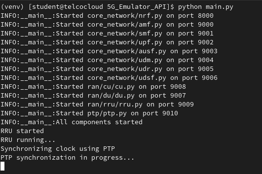
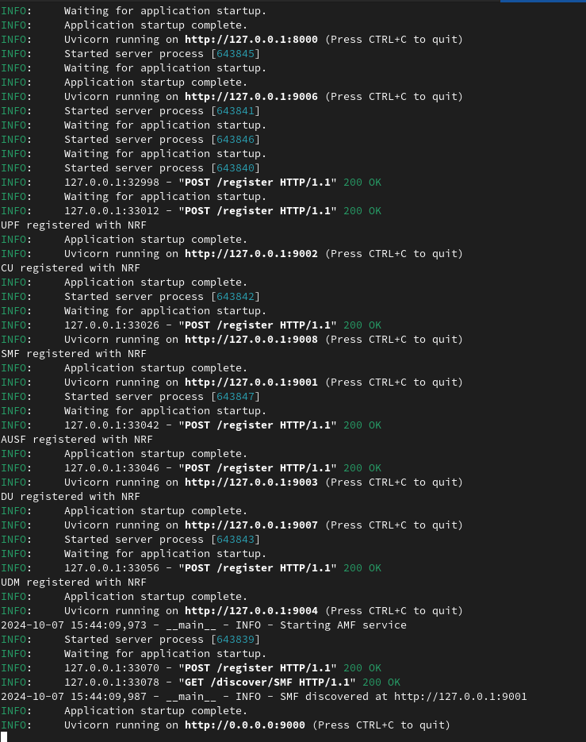
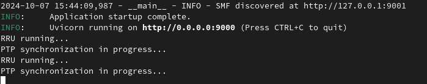

# Open Digital Platform 2.0


> **Enterprise-grade 5G network emulation platform with BlueField-3 DPU integration**

Open Digital Platform 2.0 provides a comprehensive 5G network emulator, simulating both the core network and RAN components for testing and development. It includes advanced network function (NF) scripts, testing utilities, telemetry data collection, and **production-grade N6 interface firewall capabilities** powered by NVIDIA BlueField-3 DPUs.

---

## 🚀 Key Features

- **🏗️ Complete 5G Core Network**: AMF, SMF, UPF, NRF, AUSF, UDM, UDR, UDSF simulation
- **📡 RAN Simulation**: CU, DU, RRU components with realistic network behavior
- **🛡️ N6 Interface Firewall**: Production-grade BlueField-3 DPU firewall with DOCA SDK
- **🔄 Hardware Acceleration**: Line-rate packet processing up to 400 Gbps
- **📊 Real-time Monitoring**: OpenTelemetry integration with comprehensive dashboards
- **🧪 Testing Framework**: Automated testing for all network components
- **⏱️ PTP Synchronization**: Precision Time Protocol for network synchronization

---

## 📋 Table of Contents
- [🚀 Key Features](#-key-features)
- [🏗️ Project Overview](#️-project-overview)
- [⚡ Quick Start](#-quick-start)
- [📁 Project Structure](#-project-structure)
- [🔧 Components](#-components)
- [🚀 Running the Platform](#-running-the-platform)
- [🧪 Testing](#-testing)
- [📊 Monitoring & Observability](#-monitoring--observability)
- [📷 System Screenshots](#-system-screenshots)
- [🔧 API Examples](#-api-examples)

## 🏗️ Project Overview

This enterprise-grade platform provides a complete 5G network simulation environment with advanced capabilities:

- **🏢 5G Core Network Emulation**: Production-quality implementation of AMF, NRF, SMF, UPF, AUSF, UDM, UDR, and UDSF network functions
- **📡 5G RAN Simulation**: Comprehensive Central Unit (CU), Distributed Unit (DU), and Remote Radio Unit (RRU) simulation
- **🛡️ Hardware-Accelerated Security**: NVIDIA BlueField-3 DPU powered N6 interface firewall with DOCA SDK integration
- **🧪 Advanced Testing Framework**: Automated testing suites for all network components with performance benchmarking
- **📊 Enterprise Monitoring**: OpenTelemetry integration with real-time dashboards and alerting capabilities
- **⏱️ Network Synchronization**: Precision Time Protocol (PTP) implementation for accurate timing

---

## ⚡ Quick Start

### Prerequisites


### Installation & Launch
```bash
# 1. Clone repository
git clone https://github.com/drcoopertbbt/open-digital-platform-2_0.git
cd open-digital-platform-2_0

# 2. Install dependencies
pip install -r requirements.txt

# 3. Start 5G network emulation
python main.py

# 4. Test N6 interface firewall (BlueField-3 DPU)
cd n6-interface-simulation
./scripts/test_with_devemu.sh
```

---

## 📁 Project Structure

```bash
open-digital-platform-2_0/
├── 🏗️ 5G_Emulator_API/              # Core 5G network simulation
│   ├── core_network/               # AMF, SMF, UPF, NRF, AUSF, UDM, UDR
│   ├── ran/                        # CU, DU, RRU components
│   ├── ptp/                        # Precision Time Protocol
│   └── logs/                       # Network operation logs
├── 🛡️ n6-interface-simulation/      # BlueField-3 DPU firewall
│   ├── bf3-dpu-firewall/           # DOCA SDK application
│   ├── services/                   # UPF/DN test services
│   └── scripts/                    # Test automation
├── 📊 Dashboard/                    # Monitoring dashboards
├── 📈 OpenTelemetry_Data/           # Telemetry and metrics
├── 📚 5G-Core-Stub-docs/           # Documentation
├── 🧪 test_5g_network.py           # Network testing suite
├── 🔧 main.py                      # Platform launcher
└── 📋 requirements.txt             # Dependencies
```

---

## 🔧 Components

### Core Network
The **5G_Emulator_API/core_network** folder contains enterprise-grade 5G core network functions:

| Component | Description | Port |
|-----------|-------------|------|
| **AMF** | Access and Mobility Management Function | 9000 |
| **SMF** | Session Management Function | 9001 |
| **UPF** | User Plane Function | 9002 |
| **NRF** | Network Repository Function | 9003 |
| **AUSF** | Authentication Server Function | 9004 |
| **UDM** | Unified Data Management | 9005 |
| **UDR** | Unified Data Repository | 9006 |
| **UDSF** | Unstructured Data Storage Function | 9007 |

### RAN
The **ran** folder simulates a complete Radio Access Network:
- **CU (Central Unit)**: Higher-layer protocol handling
- **DU (Distributed Unit)**: Real-time layer operations  
- **RRU (Remote Radio Unit)**: Radio transmission simulation

### N6 Interface Firewall
**NEW**: Production-grade BlueField-3 DPU firewall capabilities:
- **Hardware Acceleration**: DOCA Flow API integration
- **Line-Rate Processing**: Up to 400 Gbps throughput
- **Real-time Security**: Advanced packet filtering and blocking
- **DevEmu Testing**: Complete hardware emulation for development

[📖 **Detailed N6 Firewall Documentation**](n6-interface-simulation/README.md)

### PTP
The **ptp** folder contains Precision Time Protocol simulation for network synchronization.
---

## 🚀 Running the Platform

### Standard 5G Network Emulation
To start the complete 5G network emulator:

```bash
# Launch all 5G core and RAN components
python main.py
```

This automatically starts:
- **5G Core Network**: NRF, AMF, SMF, UPF, AUSF, UDM, UDR, UDSF
- **RAN Components**: CU, DU, RRU simulation
- **PTP Synchronization**: Network timing services
- **Monitoring**: OpenTelemetry data collection

### N6 Interface Firewall Testing
To test the BlueField-3 DPU firewall capabilities:

```bash
# Navigate to N6 simulation
cd n6-interface-simulation

# Run complete firewall test suite
./scripts/test_with_devemu.sh
```

**Expected Results:**
- ✅ Baseline connectivity validation
- 🔥 Firewall blocking demonstration  
- 📊 Real-time packet processing statistics

---

## 🧪 Testing

### Core Network Testing
```bash
# Test 5G core network components
python test_5g_network.py

# Test CU-DU interactions
python test_cu_du.py
```


### Complete Testing Suite
- ✅ **5G Core Functions**: AMF, SMF, UPF, NRF, AUSF, UDM, UDR, UDSF validation
- 📡 **RAN Components**: CU, DU, RRU interaction testing
- 🛡️ **N6 Firewall**: Hardware-accelerated packet filtering with BlueField-3 DPU
- ⏱️ **PTP Synchronization**: Network timing validation
- 📊 **Performance Benchmarks**: Throughput and latency testing

### N6 Interface Firewall Testing
```bash
# Complete BlueField-3 DPU firewall validation
cd n6-interface-simulation
./scripts/test_with_devemu.sh
```

For detailed testing instructions, refer to **test_instructions.md**.

---

## 📊 Monitoring & Observability

### Real-time Dashboards
- **📈 System Performance**: CPU, memory, network utilization
- **🔥 Firewall Statistics**: Packet processing, blocking rates
- **📡 5G Core Metrics**: Network function performance
- **⏱️ Timing Analysis**: PTP synchronization accuracy

### Log Management
```bash
# Core network logs
tail -f logs/5g_core.log

# N6 firewall logs  
tail -f n6-interface-simulation/bf3-dpu-firewall/logs/

# OpenTelemetry data
ls OpenTelemetry_Data/
```

### Telemetry Integration
All network operations generate telemetry data stored in **OpenTelemetry_Data/**, providing comprehensive insights into:
- Network performance metrics
- Security event monitoring
- Hardware utilization statistics
- Real-time alerting capabilities


---

## 📷 System Screenshots

### 5G Network Dashboard


### Real-time Performance Monitoring  


### OpenTelemetry Integration


---

## 🔧 API Examples

### AMF (Access and Mobility Management Function)

#### Initial UE Context Setup
```bash
curl -X POST http://localhost:9000/amf/ue/ue001 \
  -H "Content-Type: application/json" \
  -d '{"initial_gnb_id": "gnb001"}'

# Response:
{"message":"UE context created"}
```

#### Query UE Context
```bash
curl -X GET http://localhost:9000/amf/ue/ue001
```

#### Trigger UE Handover
```bash
curl -X POST http://localhost:9000/amf/handover \
  -H "Content-Type: application/json" \
  -d '{"ue_id": "ue001", "source_gnb_id": "gnb001"}'

# Response:
{"message":"Handover process completed","duration":0.09120726585388184}
```

### N6 Interface Firewall API
```bash
# Get firewall statistics
curl -X GET http://localhost:9090/metrics

# Configure firewall rules
curl -X POST http://localhost:8080/firewall/rules \
  -H "Content-Type: application/json" \
  -d '{"action": "block", "port": 8001, "protocol": "tcp"}'
```

---

## 🏷️ Version Information


- **Version**: 2.0
- **Build Date**: August 2024
- **5G Core**: Release 16/17 compliant
- **DOCA SDK**: 2.6.0+
- **Target Platforms**: x86_64, ARM64 (BlueField-3)

---

<div align="center">

**🌟 Open Digital Platform 2.0 - Enterprise 5G Network Simulation 🌟**


</div>